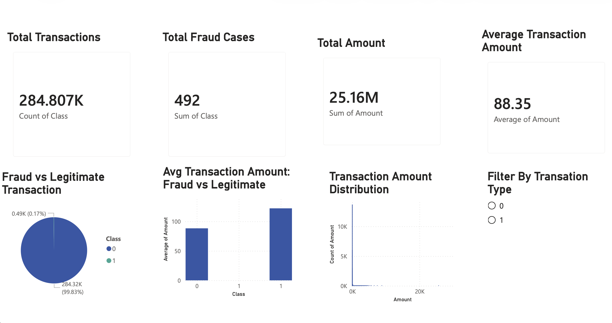
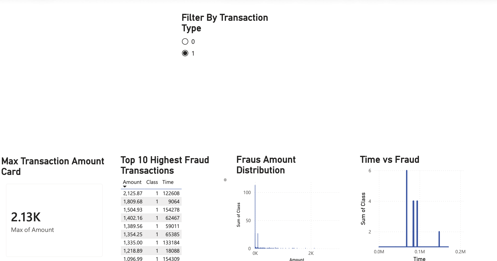

# 💳 Bank Fraud Detection Dashboard
### Built with Power BI | Author: Yuvarani Dharmasivam

---

## 📊 Project Overview

This project analyses **284,807 bank transactions** to identify fraud patterns and detect anomalies using an interactive Power BI dashboard. The dataset contains real anonymized credit card transactions, of which only **492 (0.17%)** are fraudulent — reflecting real-world fraud data imbalance.

The dashboard helps financial analysts and banking institutions:
- Identify fraud patterns quickly
- Compare fraudulent vs legitimate transaction amounts
- Monitor transaction distributions
- Filter and explore data interactively

---

## 🖥️ Dashboard Preview

### Page 1 — Transaction Overview


### Page 2 — Fraud Analysis


---

## 🔍 Key Insights

- 📌 Only **0.17%** of all transactions are fraudulent — highly imbalanced dataset
- 💰 Fraudulent transactions have a **higher average amount** than legitimate ones
- 📈 Most transactions are clustered at **low amounts**
- 🔎 **492 fraud cases** detected out of 284,807 total transactions
- 💵 Total transaction volume: **$25.16 Million**
- 🏦 Average transaction amount: **$88.35**

---

## 📁 Project Structure

```
Bank-Fraud-Detection-PowerBI/
├── README.md
├── dashboard.pdf
└── screenshots/
    ├── overview.png
    └── fraud_analysis.png
```

---

## 🛠️ Tools Used

| Tool | Purpose |
|------|---------|
| **Power BI** | Dashboard creation and visualisation |
| **Microsoft Excel/CSV** | Data preparation |
| **GitHub** | Portfolio hosting |

---

## 📂 Dataset

- **Source:** [Kaggle — Credit Card Fraud Detection](https://www.kaggle.com/datasets/mlg-ulb/creditcardfraud)
- **Rows:** 284,807 transactions
- **Features:** Time, Amount, Class (0 = Legitimate, 1 = Fraud)
- **Fraud Rate:** 0.17%

---

## 📊 Dashboard Features

**Page 1 — Transaction Overview:**
- Total Transactions KPI Card
- Total Fraud Cases KPI Card
- Total Amount KPI Card
- Average Transaction Amount KPI Card
- Fraud vs Legitimate Pie Chart
- Average Amount by Transaction Type
- Transaction Amount Distribution
- Interactive Slicer Filter

**Page 2 — Fraud Analysis:**
- Top Fraud Transactions Table
- Highest Transaction Amount Card
- Fraud Pattern Over Time Chart
- Interactive Slicer Filter

---

## 📄 View Dashboard

📥 [Download Full Dashboard PDF](dashboard.pdf)

---

## 👩‍💻 Author

**Yuvarani Dharmasivam**
- GitHub: [@YuvaraniD](https://github.com/YuvaraniD)

---

## 📌 How to Use

1. Clone this repository
2. Open `dashboard.pdf` to view the full dashboard
3. Download the dataset from Kaggle link above
4. Open `.pbix` file in Power BI Desktop for full interactivity

---


